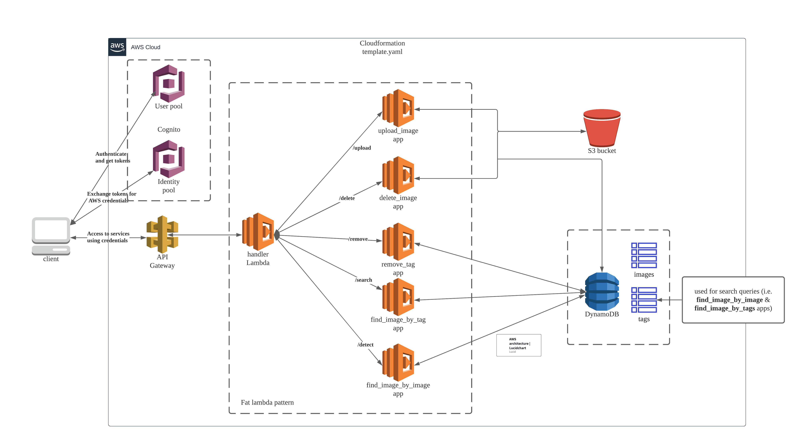

# terraform-aws

- [terraform-aws](#terraform-aws)
  - [About](#about)
  - [Developing](#developing)
    - [Running pre-commit hooks manually](#running-pre-commit-hooks-manually)
    - [Architecture](#architecture)
  - [Backend](#backend)
  - [Frontend](#frontend)
      - [TODO:](#todo)
  - [3 backend deployment options](#3-backend-deployment-options)
    - [AWS Cloudformation](#aws-cloudformation)
    - [Terraform](#terraform)
      - [TODO:](#todo-1)
    - [Terraform using serverless modules](#terraform-using-serverless-modules)
  - [Contributing](#contributing)

## About

A web app to detect objects in images and run search queries on the processed images.
The app is broken into three components, frontend backend and infrastructure.
There are three options for deploying the infrastructure.

This is a precursor for a future project.

## Developing

Please refer to the readme in each subdirectory.

Before you commit, please configure pre-commit with:

`pre-commit install`

### Running pre-commit hooks manually

`pre-commit run --all-files`

### Architecture

## Backend

The backend is a python lambda function, more information can be found in the [readme](lambdaObjectDetection/README.md)

## Frontend

The frontend is a simple React application, more information can be found in the [readme](frontend/README.md).

#### TODO:
- [ ] Cognito authorization

## 3 backend deployment options

### AWS Cloudformation

Completed

### Terraform

Everything is written from scratch using only provider modules(without importing community modules)

#### TODO:
- [ ] follow [terraform naming convention](https://www.terraform-best-practices.com/naming)
- [ ] Cognito authorization

### Terraform using serverless modules

Work in progress

## Contributing

Although, this is is a personal exercise, contributions are welcome!

Before opening a PR:

- Make sure that there isn't an active PR already open which makes the same changes
- Make sure to check if there are issues related to your PR
